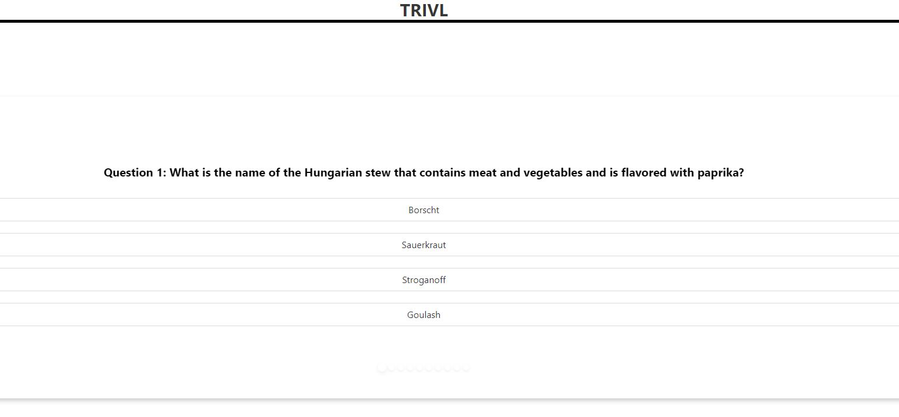

# TRIVL

## Description
This project entailed the creation of a trivia game in the style of the New York Times games Wordle, Connections, Crossword, etc.  Our game, TRIVL, is a ten question trivia game that allows users to test their knowledge across a wide variety of topics and compete with their friends in battles of wit.

## Installation
N/A

## Usage
To use the webpage, follow [this link](https://njohnson2897.github.io/trivl-project/)

The following screenshot demonstrates what the landing page should look like in a browser:

Upon first going to the page, users will be presented with a modal with an example quiz question.  Users can then click out of the modal and begin their quiz.  There are ten questions with no time limit.  All ten questions are multiple choice.  Once all ten questions are answered, a button will appear at the bottom of the quiz panel which gives users the option to submit their quiz.  They will then be redirected to a results page where they can see their score out of 10 and the answer key to review what questions were missed.  The user is then unable to play the game again until 24 hours have passed.

## Credits
The Trivia Api served as our source of trivia questions.  It is a database of over 11,000 reviewed trivia questions spanning a variety of topics.  https://the-trivia-api.com/

Co-creators of TRIVL: Robin Langton, Bryan LeBeuf, Ben Mallar, Nate Johnson
